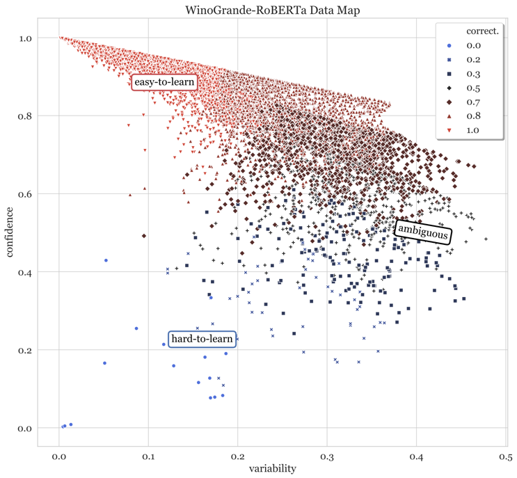

# Continual Learning with Enhanced Buffer Strategies

This repository extends the capabilities of continual learning by improving buffer-based strategies. It builds upon a
foundation of existing algorithms and methods for continual learning while introducing new enhancements.
This project aims to address these limitations by integrating insights from the paper
["Dataset Cartography: Mapping and Diagnosing Datasets with Training Dynamics"](https://aclanthology.org/2020.emnlp-main.746/)
into continual learning strategies.
<br>
In line with recent findings from the mentioned paper, our approach takes a strategic approach to update buffer. We
prioritize samples
from the "ambiguous region" of the dataset, as they are known to contain challenging examples that offer substantial
value for model learning. These samples are selected based on their variability and confidence, which are assessed
during different training epochs.
We implement this method for two buffer-based strategies: PCR and SCR.



In the image above, you can see the different regions within a dataset.
<br>_This picture is taken from the
paper ["Dataset Cartography: Mapping and Diagnosing Datasets with Training Dynamics"](https://aclanthology.org/2020.emnlp-main.746/)._

## Examples

Here's a simple example of how to use the PCR method:

### CIFAR-10

```shell
# Update buffer randomly
python general_main.py --num_tasks 5 --data cifar10 --cl_type nc --agent PCR --retrieve random --update random --mem_size 300 --seed 1000 --epoch 8 --batch 12 --eps_mem_batch 24

# Update buffer with cartography plugin
python general_main.py --num_tasks 5 --data cifar10 --cl_type nc --agent PCR --retrieve random --update Carto --mem_size 300 --seed 1000 --epoch 8 --batch 12 --eps_mem_batch 24
```

### CIFAR-100

```shell
# Update buffer randomly
python general_main.py --num_tasks 10 --data cifar100 --cl_type nc --agent PCR --retrieve random --update random --mem_size 200 --seed 1000 --epoch 6 --batch 24 --eps_mem_batch 16

# Update buffer with cartography plugin
python general_main.py --num_tasks 10 --data cifar100 --cl_type nc --agent PCR --retrieve random --update Carto --mem_size 200 --seed 1000 --epoch 6 --batch 24 --eps_mem_batch 16

```

### Model Performance Comparison

To evaluate the effectiveness of our buffer strategy,
we compared the performance of PCR with a traditional random
sample selection approach and with our buffer update strategy.

#### Random Sample Selection


**Average End Accuracy:** 0.6373 <br>
**Average End Forget:** 0.1991 <br>
**Average Accuracy:** 0.733

### Ambiguous Region Strategy


**Average End Accuracy:** 0.6547 <br>
**Average End Forget:** 0.1490 <br>
**Average Accuracy:** 0.7398
